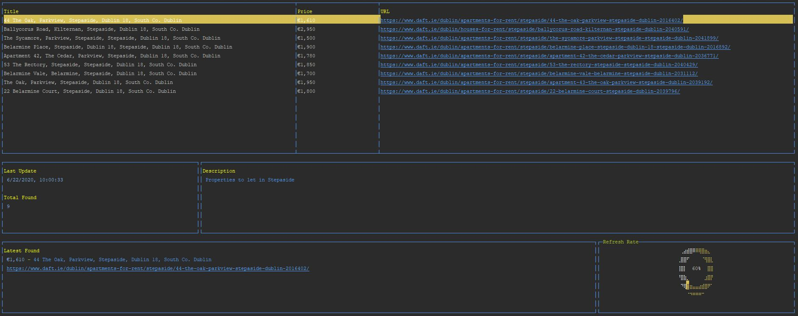

home-seek
=========

This app is used to poll and alert if a new Home appears in daft.

[](https://oclif.io)
[](https://npmjs.org/package/home-seek)
[](https://npmjs.org/package/home-seek)
[](https://github.com/flaviojmendes/home-seek/blob/master/package.json)
[](https://travis-ci.org/flaviojmendes/home-seek)

# Usage

To install the app just run:

```
npm i -g home-seek
```

To use this app simply go to Daft, perform your search. Then copy the URL and Run:

```
home-seek -u '<DAFT_SEARCH_URL>'

or if you cloned this repo:

node ./bin/run -u '<DAFT_SEARCH_URL>'
``` 

You will get:


